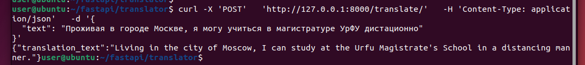
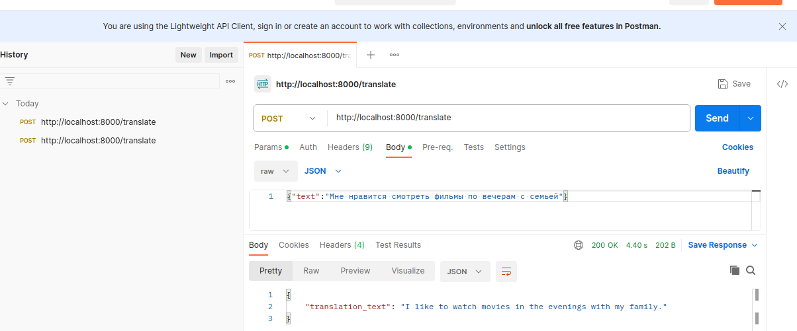

# Домашнее задание №3

---
## 1) ANGorbachev/translator.py

### Описание
*Переводчик с русского языка на английский. Для перевода используется модель [<u>"opus-mt-ru-en"</u>](https://huggingface.co/Helsinki-NLP/opus-mt-ru-en) от **Language Technology Research Group at the University of Helsinki**. Модель основана на архитектуре Трансформер и показывает неплохие результаты при не очень больших размерах самой модели (307Мб)*

---
### Запуск приложения
*Для работы кода потребуется установка зависимостей:*

```buildoutcfg
pip install -r requiremnts.txt
```
А для запуска приложения на локальном сервере неоходимо выполнить следующую команду:
```buildoutcfg
uvicorn translator:app
```
---
Пример работы приложения в curl:


Пример работы приложения в Postman:

